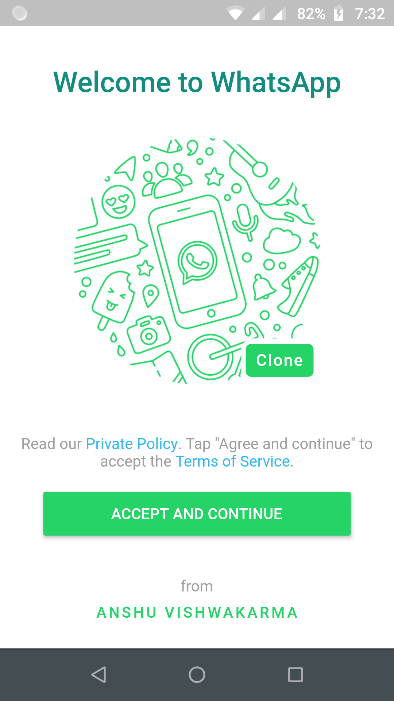

# WhatsApp Clone

The project is to create a clone of WhatsApp using Flutter.

## Screens Implemented

- [x] **Terms & Conditions**
  - [ ] Should only appear when user is logged out or new to the app.
  - [x] Provide Privacy Policy and Terms of Service, on clicking respective highlighted text.
  - [x] On clicking "accept and continue", send user to authentication page
- [ ] **Authentication**
  - [ ] **Phone Number Input**
  - [ ] **Phone Number Confirmation Dialog**
  - [ ] **OTP Input**
  - [ ] _(Optional)_ **Restoration Option**
  - [ ] **Profile Info**
- [ ] _(Optional)_ **Two Step Verification**
- [ ] **Intialization Animation**
- [ ] **Home Screen**
  - [ ] **Camera**
  - [ ] **Chats**
  - [ ] **Status**
  - [ ] **Calls**
- [ ] **Select Contacts**
- [ ] **Menu List**

  - [ ] **New Group**
  - [ ] **New broadcast**
  - [ ] **Whatsapp Web** - _Should Show Currently Unavailable_
  - [ ] **Starred Message**
  - [ ] **Settings**
  - [ ] **Add Cloud Firestore**

## Images

## Note

I'm doing this project to enhance my flutter and cloud firestore skills. I'm trying to make the app look and feel like whatsapp as close as possible
